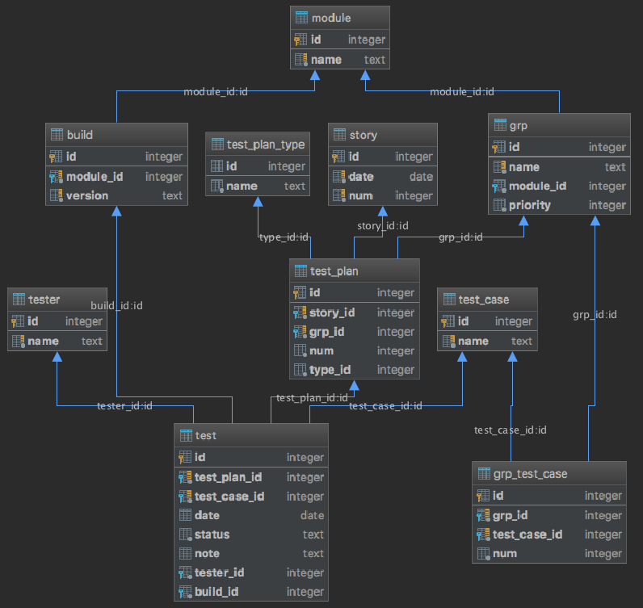

Test Case Manager is an information system that stores and processes stories (releases), 
test cases and its groups, testers, stories/releases, modules, builds, test plans, tests.
 
# Database diagram
  